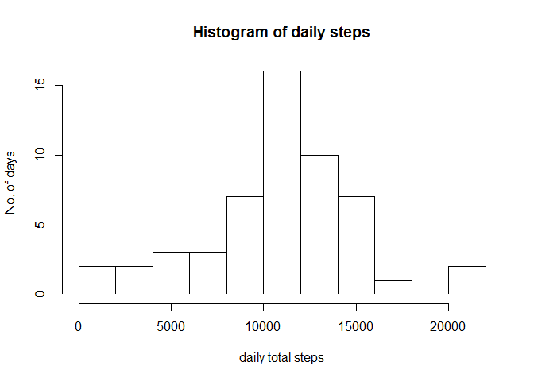
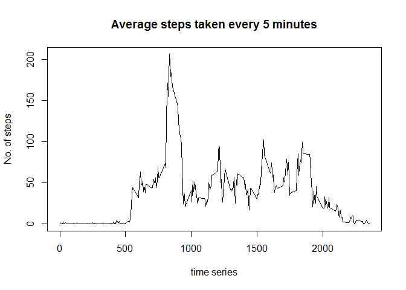
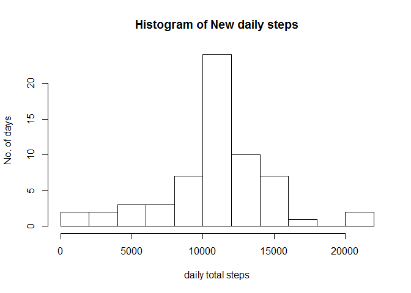
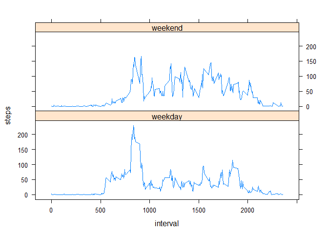

# Reproducible Research: Peer Assessment 1
This is the R markdown file for Peer Assessment 1 of Coursera course Reproducible Research.

##Loading and preprocessing the data
1. Load the data (assuming the current working directory is already set to the directory containing the zip file "activity.zip")

```r
unzip("activity.zip")
origindata <- read.csv("activity.csv")
```
2. Process/transform the data (if necessary) into a format suitable for your analysis

```r
newdata <-na.omit(origindata)
```

##What is mean total number of steps taken per day?
1. Make a histogram of the total number of steps taken each day

```r
dailytotalsteps<-aggregate(newdata$steps, by=list(newdata$date), sum)
colnames(dailytotalsteps)<- c('date','totalsteps')
hist(dailytotalsteps$totalsteps, xlab="daily total steps", ylab="No. of days", main = "Histogram of daily steps",breaks=10)
```

 

2.Calculate and report the mean and median total number of steps taken per day

```r
meanstepsperday <- mean(dailytotalsteps$totalsteps)
meanstepsperday
```

```
## [1] 10766.19
```

```r
medianstepsperday <- median(dailytotalsteps$totalsteps)
medianstepsperday
```

```
## [1] 10765
```

##What is the average daily activity pattern?
1.Make a time series plot (i.e. type = "l") of the 5-minute interval (x-axis) and the average number of steps taken, averaged across all days (y-axis)

```r
averagedailypattern <- aggregate(newdata$steps, by=list(newdata$interval),mean)
colnames(averagedailypattern) <- c("interval","meansteps")
plot(averagedailypattern$interval,averagedailypattern$meansteps, type="l", xlab = "time series", ylab="No. of steps", main = "Average steps taken every 5 minutes")
```

 

2.Which 5-minute interval, on average across all the days in the dataset, contains the maximum number of steps?

```r
maxinterval <- averagedailypattern[averagedailypattern$meansteps==max(averagedailypattern$meansteps),c(1)]
maxinterval
```

```
## [1] 835
```

##Imputing missing values
1.Calculate and report the total number of missing values in the dataset (i.e. the total number of rows with NAs)

```r
numofnas <- sum(is.na(origindata$steps))
numofnas
```

```
## [1] 2304
```

2.Devise a strategy for filling in all of the missing values in the dataset. The strategy does not need to be sophisticated. For example, you could use the mean/median for that day, or the mean for that 5-minute interval, etc.

Answer: I'm using the mean for that 5-minute interval, and round the number to whole number(integer).

3.Create a new dataset that is equal to the original dataset but with the missing data filled in.

```r
completedata <-merge(origindata,averagedailypattern,by.x="interval", by.y="interval")
completedata[is.na(completedata$steps),c(2)] <-round(completedata[is.na(completedata$steps), c(4)])
```

4.Make a histogram of the total number of steps taken each day and Calculate and report the mean and median total number of steps taken per day. Do these values differ from the estimates from the first part of the assignment? What is the impact of imputing missing data on the estimates of the total daily number of steps?

```r
newdailytotalsteps <-aggregate(completedata$steps, by=list(completedata$date), sum)
colnames(newdailytotalsteps)<- c('date','totalsteps')
hist(newdailytotalsteps$totalsteps, xlab="daily total steps", ylab="No. of days", main = "Histogram of New daily steps",breaks=10)
```

 

```r
newmeanstepsperday <- mean(newdailytotalsteps$totalsteps)
newmeanstepsperday
```

```
## [1] 10765.64
```

```r
newmedianstepsperday <- median(newdailytotalsteps$totalsteps)
newmedianstepsperday
```

```
## [1] 10762
```
The mean and median total steps per day differs a little bit comparing to the first part of the assignment.
mean total steps is changed from 10766.19 to 10765.64, while median total steps is changed from 10765 to 10762
The impact of imputing missing data on the estimates of the total daily number of steps is very small.

##Are there differences in activity patterns between weekdays and weekends?
1. Create a new factor variable in the dataset with two levels -- "weekday" and "weekend" indicating whether a given date is a weekday or weekend day.

```r
completedata$date <-as.Date(completedata$date)
f<-weekdays(completedata$date)=="Saturday" | weekdays(completedata$date)=="Sunday"
f<-as.array(f)
f[f]="weekend"
f[f==FALSE]="weekday"
f=as.factor(f)
completedata=cbind(completedata,f)
```

2.Make a panel plot containing a time series plot (i.e. type = "l") of the 5-minute interval (x-axis) and the average number of steps taken, averaged across all weekday days or weekend days (y-axis).

```r
library(lattice)
meansteps <- aggregate(completedata$steps, by=list(completedata$interval, completedata$f), mean)
colnames(meansteps) <- c("interval","f","steps")
xyplot(steps ~ interval|f,data=meansteps,layout=c(1,2),type="l")
```

 


